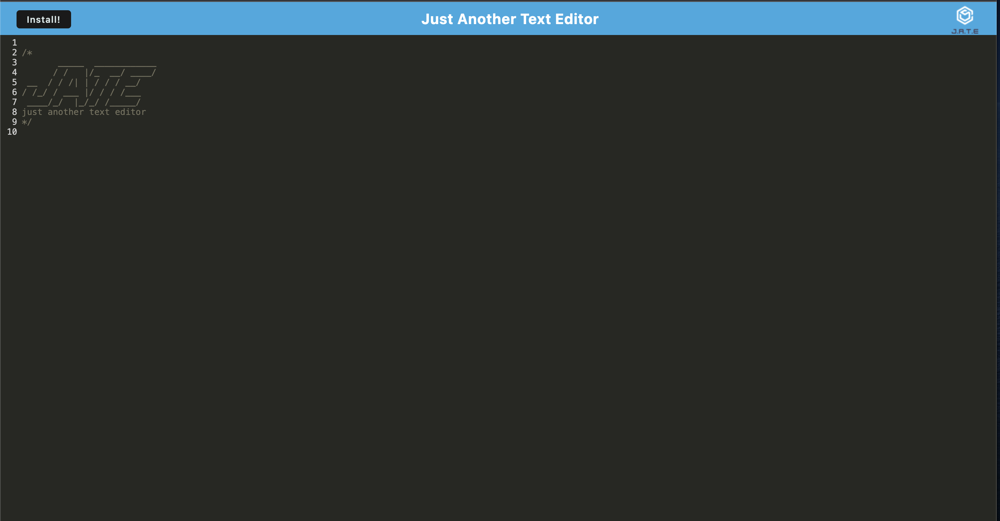

# PWA-Text-Editor

**Week 19 Challenge - Progressive Web Applications**

[](https://opensource.org/licenses/MIT) [](code_of_conduct.md)

## Table of Contents

- [Description](#description)
- [Live URL](#live-url)
- [Screenshots](#screenshots)
- [Technologies Used](#technologies-used)
- [Installation](#installation)
- [Credits](#credits)
- [Features](#features)
- [Usage Information](#usage-information)
- [Suggested Future Development](#suggested-future-development)
- [Contribution Guidelines](#contribution-guidelines)
- [Test Instructions](#test-instructions)
- [License](#license)
- [Questions](#questions)

## Description

The purpose of this application is to showcase and enhance skills in Progressive Web Application development. It focuses on four main concepts:

1. Configuring the `webpack.config.js` file with necessary Workbox plugins for service worker and manifest files, and adding CSS and Babel loaders (enabling CSS and JavaScript to compile on older legacy devices running ES5).

2. Implementing asset caching within the `src-sw.js` file to provide offline functionality.

3. Configuring the database to allow data to be added, updated, and retrieved from IndexedDB.

4. Adding event handlers to the install button, allowing the application to be installed on users' devices and used offline.

While much of this application relies on a boilerplate code structure, building it out provides a deeper understanding of libraries and frameworks like React, Angular, and Vue. While there are no plans for future development, this application can serve as a benchmark boilerplate codebase for future Progressive Web Applications.

## Live URL

[View Live Application](https://jate-text-editor15-e077c2d0ee63.herokuapp.com/)

## Screenshots



## Technologies Used

This application is powered by the following technologies:

- Webpack (HTML-Webpack-Plugin, Babel, and CSS Loader)
- Node.js (v16.19.1)
- Express.js (v14.17.1)
- JavaScript
- Nodemon (v2.0.4) and Concurrently (v5.2.0) as devDependencies


## Installation

Users can access the application through their web browser by visiting the deployed application at [https://jate-text-editor15-e077c2d0ee63.herokuapp.com/](https://jate-text-editor15-e077c2d0ee63.herokuapp.com/).

This allows users to download and use the application offline.

To make further additions, start by cloning the repository using the following command:

```bash
git clone https://github.com/Donsidious/PWA-Text-Editor
```

Alternatively, you can fork the repository.

## Credits

Much of this application's code is based on a boilerplate. The necessary additions were inherited from the Week 19 mini-challenge. I also received direct assistance from a tutor, Joem Casusi, who helped me understand Progressive Web Applications and IndexedDB.

Starter code was provided by Xander Rapstine (Xandromus) and UT Austin Boot Camps.

## Features

Once the application is open, the IndexedDB will persist any notes added to the site. There's no need to manually save information as the application automatically updates the IndexedDB. Simply click out of the window, and when you return, you'll find all your notes and other information persisted on the page.

## Usage Information

Using this application is intuitive. Visit the live URL ([https://jate-text-editor15-e077c2d0ee63.herokuapp.com/](https://jate-text-editor15-e077c2d0ee63.herokuapp.com/)) and start adding notes immediately. You'll also notice an install button in the navigation bar, allowing you to download the application and use it offline. Note-saving happens automatically through IndexedDB; all that's required is for you to click out of the window. Your notes will be persisted whether you're using the application online or offline.

## Suggested Future Development

As of now, there are no plans for further development of this application. However, this codebase can serve as a starting point for the development of future Progressive Web Applications.

## Contribution Guidelines

I'm open to collaboration. If you'd like to contribute, please open an issue and make changes on a feature branch. Wait for approval before

 merging to the main branch.

**NOTICE**: Contributor Covenant is released under the Creative Commons Attribution 4.0 International Public License, which requires attribution.

## Test Instructions

Currently, there are no unit tests written for this application.

## License

**NOTICE**: This application is covered under the MIT License.

## Questions

Do you have additional questions? You can reach out to me through my GitHub account or email address:

[Link to Github](https://github.com/Donsidious)

